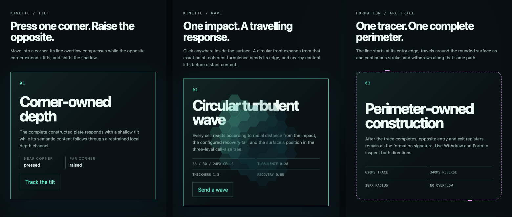
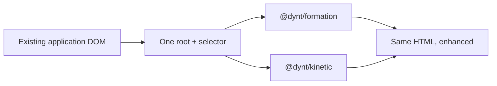

# DYNT

[](https://github.com/aibolt/dynt/actions/workflows/ci.yml)
[](LICENSE)


DYNT adds constructed geometry and physical response to an existing interface from one application boundary. It enhances matching DOM elements without replacing them or requiring changes in every component.

The two engines are independent:

- `@dynt/formation` — four-rail Line Forge and single-stroke perimeter construction with reversible deconstruction.
- `@dynt/kinetic` — corner-coupled tilt, circular turbulent cell waves, drift, impact, and content response.

Install either engine by itself, combine them through their DOM coordination contract, or use the thin React and Web Component integrations.

## See DYNT in one screen



This local integration lab uses ordinary semantic HTML with the packages from this repository. Pointer movement drives the bounded corner tilt, an impact launches the circular turbulent cell front, and Arc Trace owns one reversible perimeter stroke.

## What the current preview includes

- **Formation drama:** transient lines travel from the viewport boundaries, acquire targets in sequence, and reverse that order during withdrawal.
- **Three formation profiles:** Line Push, Line Rise, and the continuous rounded Arc Trace perimeter.
- **Physical response:** corner-coupled plate tilt moves the constructed frame and nearby semantic content through one restrained depth model.
- **Circular turbulent waves:** click or controlled impact creates a radial, turbulence-distorted front with configurable speed, thickness, recovery, intensity, and cell sizing.
- **Real cell geometry:** square, connected hexagon, circle, and interlocked diamond renderers, with a three-level size tree for nested surfaces.
- **Framework-independent adoption:** one explicit root and selector can enhance existing and dynamically inserted elements; React and Web Component packages remain thin lifecycle adapters.

## One application boundary



Formation, Kinetic, or both can be initialized at a layout boundary. Individual application components do not need to import DYNT, and either engine can be removed without requiring the other.

## Status

Version `0.5.0` is a public-preview candidate. Its package tarballs, type declarations, exports, plain-HTML examples, framework adapters, cleanup behavior, performance budgets, and Chromium/Firefox/WebKit matrix are verified locally and in CI. Registry publication remains a deliberate tagged release after the `@dynt` npm scope is configured.

## Install

After the packages are published, install only what the application uses:

```bash
npm install @dynt/formation
npm install @dynt/kinetic
```

React and Web Component helpers are separate packages:

```bash
npm install @dynt/react
npm install @dynt/web-components
```

## Plain HTML integration

```ts
import { createFormation } from "@dynt/formation";
import "@dynt/formation/styles.css";

const formation = createFormation({
  root: document.querySelector("#app"),
  selector: "section, article, button, [data-surface]",
  observe: true,
  viewportFlow: true,
});
```

```ts
import { createKinetic, kineticPresets } from "@dynt/kinetic";
import "@dynt/kinetic/styles.css";

const kinetic = createKinetic({
  ...kineticPresets.structural,
  root: document.querySelector("#app"),
  selector: "section, article, button, [data-surface]",
  observe: true,
});
```

The root and selector are always explicit. Matching elements added later are adopted when `observe` is enabled. Add `data-dynt-ignore` to exclude a subtree. Call `destroy()` when the application boundary is removed to restore all application-owned DOM state.

## Packages

| Package | Purpose | Requires the other engine |
| --- | --- | --- |
| `@dynt/formation` | Viewport flow lines, Line Forge rails, Arc Trace, lifecycle, profiles, and tokens | No |
| `@dynt/kinetic` | Cell geometry, circular turbulent waves, tilt, drift, impact, and content channels | No |
| `@dynt/react` | Independent React hooks for either engine | No; engines are optional peers |
| `@dynt/web-components` | Independent custom-element helpers for either engine | No; engines are optional peers |

## Quality gates

- 49 Formation unit, DOM, profile, lifecycle, bidirectional viewport-flow, shadow-root, and performance checks.
- 30 Kinetic unit, DOM, input, geometry, semantic-content, wave, shadow-root, and performance checks.
- 6 adapter checks across React and Web Components.
- 2 composition checks covering initialization and cleanup order.
- 28 passing browser checks plus two intentional visual-test skips across Chromium, Firefox, and WebKit.
- Clean tarball installation and import verification for all four public packages.
- High-severity dependency audit and reproducible release workflow.

Run the full local verification:

```bash
npm test
npm run test:browser
npm run test:packages
npm audit --audit-level=high
```

See the [API reference](docs/API.md), [accessibility contract](docs/ACCESSIBILITY.md), [combined-operation guide](docs/COMPOSITION.md), [performance budgets](docs/PERFORMANCE.md), [troubleshooting guide](docs/TROUBLESHOOTING.md), [architecture](docs/ARCHITECTURE.md), and [roadmap](docs/ROADMAP.md). Maintainers can use the [release and rollback guide](docs/RELEASING.md); vulnerabilities follow the [security policy](SECURITY.md).

## License

DYNT is available under the [MIT License](LICENSE). Contributions follow [the project contribution policy](CONTRIBUTING.md).
