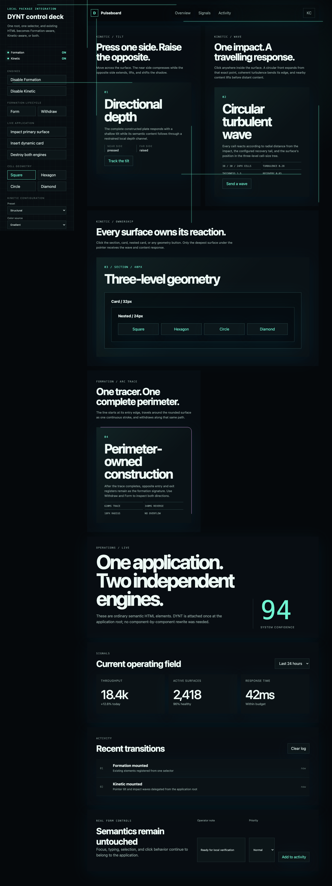
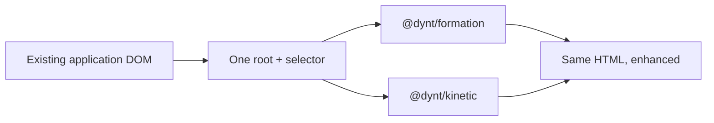

# DYNT

[](https://github.com/aibolt/dynt/actions/workflows/ci.yml)
[](LICENSE)


DYNT adds constructed geometry and physical response to an existing interface from one application boundary. It enhances matching DOM elements without replacing them or requiring changes in every component.

The two engines are independent:

- `@dynt/formation` — four-rail Line Forge and single-stroke perimeter construction with reversible deconstruction.
- `@dynt/kinetic` — directional tilt, circular turbulent cell waves, drift, impact, and content response.

Install either engine by itself, combine them through their DOM coordination contract, or use the thin React and Web Component integrations.

## See DYNT in one screen



The parity laboratory uses ordinary semantic HTML and one root-level Kinetic controller. Tilt and Wave are shown separately, nested surfaces resolve their own selector-group settings, and dynamically inserted targets are adopted without component-level integration.

[Watch the short motion proof](docs/assets/dynt-parity-lab.webm) showing directional tilt, a turbulent wave, button-owned geometry, withdrawal, and reverse formation.

## What the current preview includes

- **Formation drama:** transient lines travel from the viewport boundaries, acquire targets in sequence, and reverse that order during withdrawal.
- **Nine formation profiles:** Line Push, Line Rise, Arc Trace, Squircle Sweep, Chamfer Fold, Magnetic Segment, Radial Compass, Aperture Iris, and Elastic Membrane.
- **Physical response:** directional plate tilt compresses the near side, opens the far side, and moves the constructed frame and locally owned content through one restrained depth model.
- **Circular turbulent waves:** click or controlled impact creates a radial, turbulence-distorted front with configurable speed, thickness, recovery, intensity, and cell sizing.
- **Real cell geometry:** square, connected hexagon, circle, and interlocked diamond renderers, with a three-level size tree for nested surfaces.
- **Selector-group configuration:** ordered local groups override root Kinetic settings for sections, cards, nested surfaces, and controls while deepest-target ownership keeps responses isolated.
- **Framework-independent adoption:** one explicit root and selector can enhance existing and dynamically inserted elements; the plain DOM, React, and Web Component examples run the same engines and configuration model.

## One application boundary



Formation, Kinetic, or both can be initialized at a layout boundary. Individual application components do not need to import DYNT, and either engine can be removed without requiring the other.

## Status

Version `0.5.0` is the first public-preview release. All four packages are available from npm, and their registry integrities match the clean tarballs verified by the repository package gate. Type declarations, exports, plain-HTML examples, framework adapters, cleanup behavior, performance budgets, and the Chromium/Firefox/WebKit matrix are verified locally and in CI.

## Install

Install only what the application uses:

```bash
npm install @dynt/formation
npm install @dynt/kinetic
```

React and Web Component helpers are separate packages:

```bash
npm install @dynt/react
npm install @dynt/web-components
```

## Plain HTML integration

```ts
import { createFormation } from "@dynt/formation";
import "@dynt/formation/styles.css";

const formation = createFormation({
  root: document.querySelector("#app"),
  selector: "section, article, button, [data-surface]",
  observe: true,
  viewportFlow: true,
});
```

```ts
import { createKinetic, kineticPresets } from "@dynt/kinetic";
import "@dynt/kinetic/styles.css";

const kinetic = createKinetic({
  ...kineticPresets.structural,
  root: document.querySelector("#app"),
  selector: "section, article, button, [data-surface]",
  observe: true,
  groups: [
    { selector: "article", cells: { size: 32 }, motion: { maxTilt: 1.1 } },
    { selector: "button", cells: { shape: "hexagon", size: 22 }, motion: { maxTilt: 0.8 } },
  ],
});
```

The root and selector are always explicit. Matching elements added later are adopted when `observe` is enabled. Add `data-dynt-ignore` to exclude a subtree. Call `destroy()` when the application boundary is removed to restore all application-owned DOM state.

## Packages

| Package | Purpose | Requires the other engine |
| --- | --- | --- |
| `@dynt/formation` | Viewport flow lines, Line Forge rails, responsive SVG constructions, lifecycle, profiles, and tokens | No |
| `@dynt/kinetic` | Cell geometry, circular turbulent waves, tilt, drift, impact, and content channels | No |
| `@dynt/react` | Independent React hooks for either engine | No; engines are optional peers |
| `@dynt/web-components` | Independent custom-element helpers for either engine | No; engines are optional peers |

## Quality gates

- Formation unit, DOM, profile, lifecycle, bidirectional viewport-flow, shadow-root, responsive-renderer, and performance checks.
- Kinetic unit, DOM, selector-group, input, geometry, semantic-content, wave, ownership, shadow-root, and performance checks.
- React and Web Component lifecycle checks, plus a browser example proving configuration parity with plain DOM.
- Composition checks covering independent installation, coordination, nested ownership, and cleanup order.
- Chromium, Firefox, and WebKit browser verification without fixed-delay assertions.
- Clean tarball installation and browser verification for all four public packages.
- High-severity dependency audit and reproducible release workflow.

Run the full local verification:

```bash
npm test
npm run test:browser
npm run test:packages
npm audit --audit-level=high
```

Explore the [Formation gallery](examples/formation-browser), [Kinetic laboratory](examples/kinetic-browser), and [plain DOM, React, and Web Component comparison](examples/framework-browser). See the [API reference](docs/API.md), [accessibility contract](docs/ACCESSIBILITY.md), [combined-operation guide](docs/COMPOSITION.md), [performance budgets](docs/PERFORMANCE.md), [troubleshooting guide](docs/TROUBLESHOOTING.md), [architecture](docs/ARCHITECTURE.md), and [roadmap](docs/ROADMAP.md). Maintainers can use the [release and rollback guide](docs/RELEASING.md); vulnerabilities follow the [security policy](SECURITY.md).

## License

DYNT is available under the [MIT License](LICENSE). Contributions follow [the project contribution policy](CONTRIBUTING.md).
