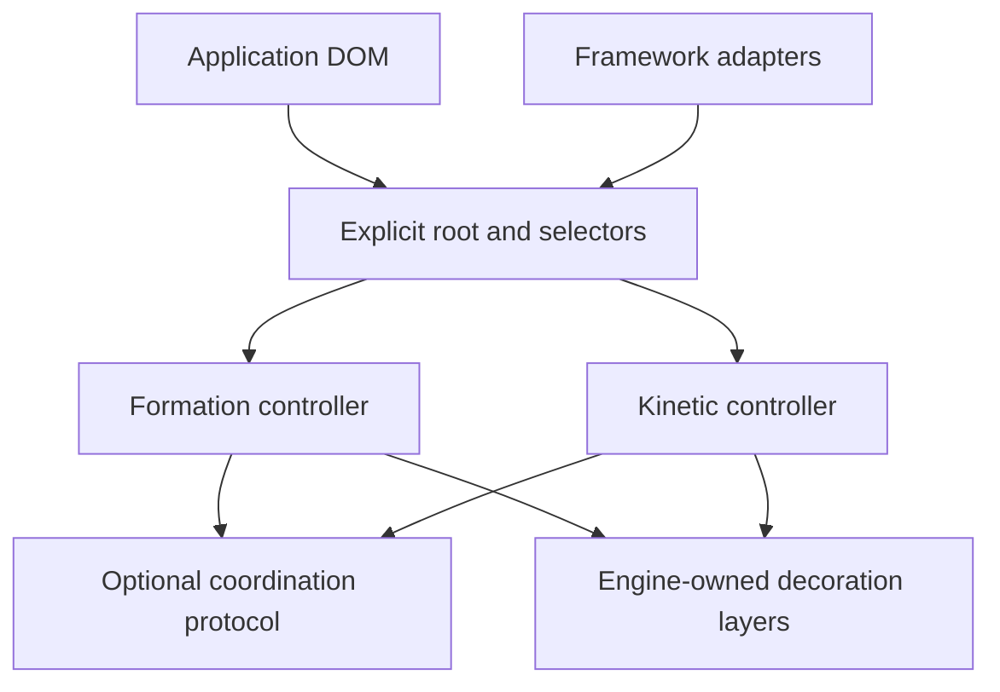

# DYNT Implementation Plan

Status: the `0.5.0` preview implementation and its local verification gates are complete. This document preserves the design contracts that shaped the implementation; [the roadmap](ROADMAP.md) records current delivery, and npm scope access remains the only external release operation.

## 1. Product objective

DYNT will let a developer add constructed visual formations, physical interface responses, or both to an existing application without editing each individual component.

A developer will initialize DYNT once against an explicit application root and a set of selectors. DYNT will enhance matching existing elements, observe matching elements added later, and provide complete cleanup when the application unmounts or disables the engine.

Formation and Kinetic are separate products:

- `@dynt/formation` constructs, encloses, reveals, withdraws, and deconstructs interface geometry.
- `@dynt/kinetic` adds directional tilt, drift, circular turbulent waves, impact, and content response.

Either package must work by itself. Installing or using one package must not install, initialize, or require the other.

## 2. Success criteria

DYNT is ready for a stable release when all of the following are true:

- One root-level initializer can enhance an existing application without component-by-component edits.
- Existing and dynamically inserted matching elements are handled consistently.
- Formation-only, Kinetic-only, and combined operation pass independent contract tests.
- Cleanup restores application-owned classes, attributes, inline styles, event behavior, and focus behavior.
- Reduced-motion behavior preserves meaning and lifecycle order without unnecessary motion.
- Framework adapters contain integration code only; engine behavior remains framework-independent.
- Nested surfaces keep effects local to the nearest owning surface.
- Idle pages perform no continuous animation work.
- Public APIs, examples, package exports, and release procedures are documented and tested.
- Every outside contribution receives manual owner review; maintainer-authored work passes the same automated gates and may be owner-approved.

## 3. User integration model

### 3.1 Plain HTML or framework-independent applications

The target API is a single initializer per engine:

```ts
import { createFormation } from "@dynt/formation";
import "@dynt/formation/styles.css";

const formation = createFormation({
  root: document.querySelector("#app"),
  selector: "section, article, button, [data-surface]",
  profile: "line-push",
  observe: true,
  exclude: "[data-dynt-ignore]",
});
```

```ts
import { createKinetic } from "@dynt/kinetic";

const kinetic = createKinetic({
  root: document.querySelector("#app"),
  selector: "section, article, button, [data-surface]",
  observe: true,
  effects: {
    tilt: true,
  },
});
```

These examples use the implemented public shape. Each option is covered by contract tests.

### 3.2 Framework applications

Framework adapters will initialize an engine once at an application or layout boundary. They will respond to mount, update, and unmount events without requiring every component to import DYNT.

Adapters will provide independent entry points for Formation and Kinetic. Applications may enable either entry point or both.

### 3.3 Explicit control

DYNT will not take over the entire document automatically. The developer must provide an explicit root and selector or use a documented selector preset.

The integration contract will include:

- `data-dynt-ignore` to exclude a subtree.
- Local data attributes or controller methods for supported overrides.
- Controller methods to refresh, update, pause, resume, and destroy an engine where applicable.
- Explicit registration for shadow roots; DYNT will not silently cross shadow boundaries.

## 4. Architecture



### 4.1 Engine ownership

Each controller owns only the DOM markers, listeners, observers, animation handles, and decoration layers it creates. Ownership will be recorded in internal `WeakMap` state so repeated initialization remains idempotent and cleanup remains exact.

### 4.2 Decoration strategy

DYNT must not replace host elements or overwrite application transforms and backgrounds.

The rendering strategy will use:

1. Low-specificity CSS and custom properties for compatible elements.
2. Engine-owned decoration layers when pseudo-elements are unavailable or unsafe.
3. Explicit opt-in content reactors when motion must affect content.
4. Separate geometry and motion channels so Kinetic cannot distort Formation geometry accidentally.

### 4.3 Scheduling

Each root will use shared scheduling rather than one loop per element:

- One delegated input pipeline per root.
- Mutation work batched into one refresh operation.
- Measurements grouped before writes.
- At most one active animation-frame scheduler per engine and root.
- No animation frames retained while the engine is idle.

### 4.4 Optional coordination

Combined operation will use a small DOM-level coordination protocol. Neither engine will import the other.

The protocol will define:

- Surface ownership and nesting depth.
- Engine-owned CSS variable namespaces.
- Formation phase notifications.
- Kinetic input suppression during unsafe formation phases.
- Shared decoration-layer ordering.
- Cleanup order when one engine is removed before the other.

## 5. Public controller contracts

### 5.1 Formation controller

The planned Formation controller will expose:

- `elements` — a read-only snapshot of enhanced elements.
- `refresh()` — enhance new matches and reconcile removed matches.
- `update(options)` — apply supported configuration changes without rebuilding the application.
- `form(target?)` — start construction for one target or the managed set.
- `withdraw(target?)` — reverse the visible lifecycle.
- `destroy()` — remove all Formation-owned state and observers.
- `subscribe(listener)` — receive lifecycle transitions without binding to DOM implementation details.

### 5.2 Kinetic controller

The planned Kinetic controller will expose:

- `elements` — a read-only snapshot of managed surfaces.
- `refresh()` — reconcile current matches.
- `update(options)` — change supported effects and tokens.
- `impact(target, input?)` — trigger a controlled local impact.
- `pause()` and `resume()` — suspend and restore input processing.
- `destroy()` — remove listeners, observers, frames, layers, and owned state.

### 5.3 Error behavior

Public APIs will reject invalid roots, empty selectors, unknown profiles, and invalid effect configuration with actionable errors during development. Unsupported elements will be skipped or handled by a documented decoration mode; they will not be mutated partially.

## 6. Formation implementation

### 6.1 Reference profile

Line Push is the reference Formation profile. It must prove the complete engine contract before additional profiles are added.

The profile will support:

- Line-led construction without fade, pulse, or zoom shortcuts.
- Enclosure before content reveal.
- Reverse withdrawal and deconstruction.
- Responsive remeasurement.
- Configurable line color, width, timing, easing, and origin.
- Reduced-motion sequencing.
- Complete cleanup.

### 6.2 Lifecycle

The Formation lifecycle will use explicit phases:

1. `unformed`
2. `locating`
3. `constructing`
4. `enclosed`
5. `revealing`
6. `formed`
7. `withdrawing`
8. `deconstructing`
9. `unformed`

Transitions will be deterministic, reversible, cancellable, and testable. A new command will replace or reverse the active transition instead of creating overlapping animation history.

### 6.3 Target discovery

Formation will:

- Enhance matches that exist at initialization.
- Observe additions and removals when `observe` is enabled.
- Batch mutation records before querying.
- Respect excluded subtrees.
- Avoid double enhancement across nested controllers.
- Restore elements removed from the managed root.
- Support a manual `refresh()` path when observation is disabled.

### 6.4 Profile registry

After Line Push passes all contract gates, Formation will add a typed profile registry. A profile will declare geometry, supported options, lifecycle hooks, capability constraints, and its rendering strategy.

Additional profiles will be accepted one at a time. Each must pass the same lifecycle, cleanup, accessibility, responsive, and performance contract as Line Push.

## 7. Kinetic implementation

### 7.1 Minimum viable effects

The first Kinetic release will implement bounded surface tilt from delegated pointer position.

Both effects must work on plain HTML without Formation.

### 7.2 Input model

Kinetic will use delegated pointer events at the configured root. It will resolve the nearest managed surface, normalize pointer position, and write only engine-owned state.

Keyboard interaction will not depend on pointer movement. Touch and pen input will receive explicit behavior rather than inheriting mouse assumptions.

### 7.3 Motion model

Kinetic motion will use bounded targets, damped interpolation, and a deterministic return to rest. Configuration will expose safe ranges rather than arbitrary unbounded values.

The engine will stop scheduling when all managed effects reach rest.

### 7.4 Advanced effects

Advanced effects will be introduced separately after the minimum engine is stable:

1. Organic drift.
2. Circular turbulent wave.
3. Local impact and rebound.
4. Content response.
5. Configurable cell geometry and color sources.

Each effect must be independently enabled, locally owned, removable, reduced-motion aware, and subject to a rendering budget.

The portable renderer implements click- and impact-driven circular flow on an engine-owned canvas. Coherent turbulence distorts radial distance while square, connected hexagon, circle, and interlocked diamond geometry share one scheduler and automatic three-level surface sizing. Color sources support a single color, discrete bands, or interpolated gradients. Flow configuration exposes bounded speed, thickness, recovery, intensity, turbulence, growth, size-aware terminal overflow, deterministic seeds, and optional bounded multi-wave operation.

### 7.5 Rendering budget

Kinetic will enforce measurable limits:

- No continuous idle rendering.
- One scheduler per root.
- Configurable caps on active surfaces and content reactors.
- Bounded device-pixel ratio for canvas effects.
- Bounded cell count for active wave fronts.
- Older reactions on the same target replaced instead of accumulated.

## 8. Combined operation

Combined mode must preserve the guarantees of both independent packages.

Acceptance requires:

- Formation-only tests pass with Kinetic absent.
- Kinetic-only tests pass with Formation absent.
- Combined tests pass regardless of initialization order.
- Destroying one engine does not damage the other.
- Nested surfaces route input to the nearest owner.
- Kinetic motion does not separate constructed geometry from its owning surface.
- Lifecycle transitions do not leave waves, impacts, or pointer state attached to removed elements.
- Reduced-motion policy is consistent across both engines.

## 9. Framework support

### 9.1 Adapter rules

Every adapter must:

- Call the framework-independent engine API.
- Initialize once at an application boundary.
- Be safe under repeated mount and cleanup cycles.
- Avoid rendering a separate DYNT component for every target element.
- Remain safe during server rendering and hydration.
- Pass the same engine contract tests plus framework lifecycle tests.

### 9.2 Delivery order

1. React adapter.
2. Web Component helper.
3. Vue adapter based on demonstrated demand.
4. Svelte adapter based on demonstrated demand.

Framework packages will expose independent Formation and Kinetic entry points. Adding an adapter must not move behavior out of the engines.

## 10. Configuration system

Configuration will be layered in this order:

1. Package defaults.
2. Root controller options.
3. Selector-group options.
4. Supported local element overrides.
5. Temporary controller commands.

All public configuration will be:

- Typed.
- Normalized at the boundary.
- Serializable where practical.
- Validated before DOM mutation.
- Stable across refreshes.
- Restored on destroy when it changes element-owned state.

CSS custom properties will use the `--dynt-` namespace. DOM markers and events will use the `data-dynt-` and `dynt:` namespaces.

## 11. Accessibility requirements

Every phase must preserve:

- Native element semantics.
- Keyboard reachability and operation.
- Visible focus indicators.
- Reading and tab order.
- Form control labels and states.
- Screen-reader names and descriptions.
- Sufficient contrast for required visual information.
- A meaningful reduced-motion experience.

Decorative layers will be ignored by assistive technology and will never intercept pointer input. DYNT will not add focusable decoration elements.

## 12. Testing strategy

### 12.1 Unit tests

- Configuration normalization.
- Selector validation and exclusion.
- Lifecycle transitions and cancellation.
- Ownership and cleanup records.
- Motion math and bounds.
- Profile and effect capability checks.

### 12.2 DOM contract tests

- Existing elements.
- Dynamically inserted and removed elements.
- Nested roots and nested surfaces.
- Repeated initialization.
- Refresh and destroy cycles.
- Application-owned class, attribute, and style restoration.
- Unsupported and disconnected elements.
- Shadow-root registration.

### 12.3 Browser tests

- Chromium, Firefox, and WebKit.
- Pointer, touch, keyboard, and reduced motion.
- Responsive resizing.
- Form controls and replaced elements.
- Framework mount, update, and unmount behavior.

### 12.4 Visual regression

Reference examples will capture lifecycle checkpoints rather than only final screenshots. Visual testing will cover construction order, line attachment, nested ownership, responsive geometry, reduced motion, and cleanup.

### 12.5 Performance tests

Benchmarks will measure initialization, mutation reconciliation, active input, idle work, memory cleanup, and large target sets. A regression budget must be recorded before the first public preview.

## 13. Repository and release engineering

### 13.1 Pull-request gates

Every implementation pull request must pass:

- Type checking and package build.
- Unit and DOM tests.
- Browser tests when interaction behavior changes.
- High-severity dependency audit.
- Manual owner review.

### 13.2 Package publishing

Package manifests become publishable only after the license, names, exports, and preview criteria are approved. Registry publication still requires owner access to the npm scope.

Publishing will include:

- Independent package versions.
- Explicit package exports and type declarations.
- Reproducible builds from a clean checkout.
- Release notes and migration notes.
- npm provenance when the release workflow is configured.
- A rollback procedure for a faulty release.

### 13.3 Version milestones

- `0.1.x` — Formation preview with Line Push and static DOM enhancement.
- `0.2.x` — Formation lifecycle, observation, cleanup, and accessibility contract.
- `0.3.x` — Independent Kinetic preview with tilt and impact.
- `0.4.x` — Combined ownership protocol and advanced interaction work.
- `0.5.x` — First framework adapter and browser matrix.
- `1.0.0` — Stable APIs, complete documentation, release automation, and satisfied quality gates.

Version numbers describe intended maturity and may be adjusted before publishing.

## 14. Documentation and examples

The public documentation set will include:

- Installation and plain HTML quick start.
- Formation-only guide.
- Kinetic-only guide.
- Combined-operation guide.
- Public API reference.
- Configuration and token reference.
- Framework adapter guides.
- Accessibility and reduced-motion guidance.
- Performance guidance.
- Troubleshooting and cleanup guidance.
- Contributor and release procedures.

Examples will remain outside engine packages and will consume public package exports only.

## 15. Implementation phases and gates

### Phase 0 — Foundation

Deliverables:

- Repository governance and manual review policy.
- Independent package workspaces.
- Architecture, implementation plan, and roadmap.
- Public license decision.
- Initial continuous-integration workflow.

Gate: repository policies, license, package boundaries, and required checks are approved.

### Phase 1 — Formation DOM contract

Deliverables:

- Existing-element enhancement.
- Mutation observation and exclusion.
- Idempotent refresh and exact cleanup.
- Selector, root, and unsupported-element validation.
- DOM contract tests.

Gate: one initializer reliably manages existing and future elements without component edits.

### Phase 2 — Formation lifecycle

Deliverables:

- Full Line Push lifecycle.
- Reverse deconstruction and cancellation.
- Lifecycle subscription and commands.
- Responsive measurement.
- Reduced-motion and accessibility verification.

Gate: Line Push passes lifecycle, browser, accessibility, visual, and cleanup tests.

### Phase 3 — Formation extensibility

Deliverables:

- Typed profile registry.
- Configuration layering and tokens.
- Profile authoring contract.
- One additional profile used to validate extensibility.

Gate: a new profile can be added without changing engine internals or public controller behavior.

### Phase 4 — Kinetic DOM contract

Deliverables:

- Independent package build.
- Delegated pointer input.
- Directional tilt with near-side compression and far-side expansion.
- Bounded motion and idle suspension.
- Refresh, pause, resume, and destroy.

Gate: Kinetic passes plain HTML tests with Formation absent.

### Phase 5 — Advanced Kinetic effects

Deliverables:

- Drift, circular waves, impact, and content response introduced as separate reviewed changes.
- Rendering caps and performance benchmarks.
- Nested ownership and effect isolation.

Gate: each effect meets performance, cleanup, reduced-motion, and ownership contracts independently.

### Phase 6 — Composition

Deliverables:

- Optional coordination protocol.
- Initialization-order independence.
- Shared layer ordering and transform safety.
- Combined examples and tests.

Gate: independent and combined matrices pass without either package requiring the other.

### Phase 7 — Framework adapters

Deliverables:

- React integration first.
- Server-rendering, hydration, repeated-mount, and cleanup tests.
- Web Component helper.
- Additional adapters based on demand.

Gate: an application enables DYNT once at its root without changing individual components.

### Phase 8 — Public preview

Deliverables:

- Approved license.
- Package publishing workflow.
- Complete quick starts and API reference.
- Browser and performance matrices.
- Preview release notes and issue templates.

Gate: preview packages install from a clean project and all documented examples work.

### Phase 9 — Stable release

Deliverables:

- Stable API review.
- Security and dependency review.
- Accessibility and performance audit.
- Upgrade and rollback documentation.
- `1.0.0` release.

Gate: every success criterion in this plan is verified with recorded evidence.

## 16. Completed implementation queue

Work should continue in this order:

1. [x] Add `observe` support to Formation with one batched `MutationObserver` per controller.
2. [x] Add `exclude` handling and tests for excluded subtrees.
3. [x] Reconcile removed elements and restore Formation-owned state.
4. [x] Add repeated-initialization and nested-root ownership tests.
5. [x] Define the Formation phase type and transition table.
6. [x] Implement reverse Line Push deconstruction.
7. [x] Add reduced-motion lifecycle tests.
8. [x] Add browser verification for buttons, links, sections, and form controls.
9. [x] Add continuous integration for build, test, audit, package, and browser gates.
10. [x] Review Phase 1 evidence before adding another profile and Kinetic.

## 17. Release decisions

Recorded decisions:

- Public license: MIT.
- Package names: `@dynt/formation`, `@dynt/kinetic`, `@dynt/react`, and `@dynt/web-components`.
- Browser policy: current evergreen Chromium, Firefox, and WebKit engines, verified through the pinned Playwright matrix.
- Public preview performance budget: 500-target Formation operations complete within 1000 milliseconds and Kinetic operations within 2000 milliseconds in the test environment; Kinetic defaults to 250 managed and 24 active surfaces.
- Framework delivery: React and Web Components are included; additional adapters require demonstrated demand.
- Security reporting: private GitHub security advisories.
- Release procedure: synchronized `0.5.0` preview packages, tagged automation, clean-package verification, provenance, and immutable-version rollback.

Owner access to the `@dynt` npm organization and the trusted-publisher configuration remain external release operations.

## 18. Definition of done

A task is complete only when:

- The implementation matches one stated scope.
- Tests prove the new behavior and relevant cleanup path.
- Build and audit checks pass.
- Public behavior is documented.
- The complete diff has been manually reviewed.
- Agent assistance is disclosed when material.
- No unrelated changes are included.
- A required owner approves the pull request.
